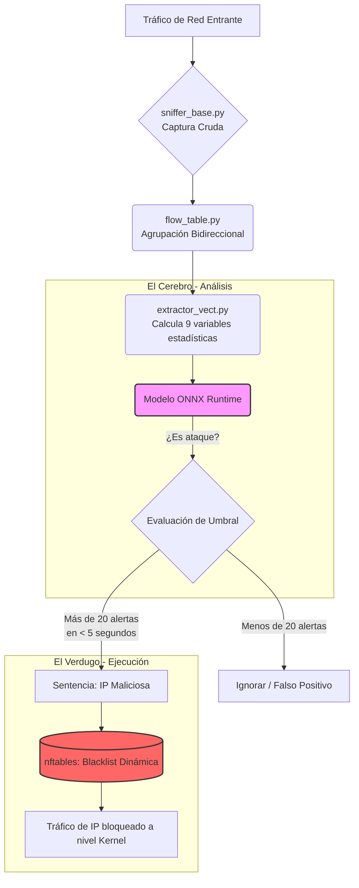

# Construyendo un Firewall montado en hardware (CM) Inteligente: Avances y Decisiones

El presente documento detalla los avances del desarrollo logrado en la construcción de un firewall inteligente, diseñado no solo para el filtrado estático de puertos, sino para la detección proactiva y en tiempo real de comportamientos maliciosos, tales como escaneos de red y ráfagas de paquetes. A continuación, dejo un resumen de la arquitectura del sistema, la lógica operativa y la justificación tecnológica que fundamenta cada una de las decisiones tomadas durante el desarrollo.

## Arquitectura del Sistema y Estado Actual

El proyecto lo estructuré en módulos independientes para garantizar su escalabilidad y facilitar su mantenimiento. Esta arquitectura se divide en dos grandes fases: la captura de datos y el análisis mediante inteligencia artificial.

En la fase de captura, el sistema interactúa directamente con la interfaz de red a través del módulo de captura cruda (`sniffer_base.py`), el cual extrae información a nivel de enlace, red y transporte de forma altamente eficiente. Posteriormente, el gestor de flujos (`flow_table.py`) agrupa lógicamente los paquetes individuales en flujos de comunicación bidireccionales, proporcionando un contexto temporal completo de cada conexión. Finalmente, el extractor de características (`extractor_vect.py`) procesa los datos de los flujos cerrados y calcula propiedades estadísticas y matemáticas para generar un vector representativo de 9 variables (preliminarmente).

En cuanto a la fase de análisis, el sistema cuenta con un pipeline de entrenamiento (`train_edge_model.py`) que genera un modelo LightGBM a partir de millones de conexiones reales. Este modelo aprende a distinguir el tráfico legítimo de los ataques y, para optimizar su despliegue, es exportado al estándar universal ONNX (`firewall_edge_model.onnx`). Este formato produce un archivo ultraligero de aproximadamente 110 KB que opera sin depender de bibliotecas pesadas. Todo esto es validado a través de un sistema de evaluación dedicado (`evaluate_onnx_model.py`).

## Rendimiento y Estadísticas del Modelo

A fin de validar empíricamente la efectividad del sistema para satisfacer los criterios de aceptación principales, se sometió al modelo a una evaluación exhaustiva empleando un conjunto de datos de prueba que la inteligencia artificial no había procesado durante su entrenamiento. Los resultados obtenidos reflejan una altísima capacidad de detección para los vectores de ataque objetivo.

Específicamente, para los ataques de fuerza bruta y ráfagas de paquetes (tales como DDoS y flujos automatizados tipo hping3), el modelo alcanzó una precisión de detección del **99.64%** evaluado sobre un total de 25,605 muestras. Simultáneamente, para la detección de escaneos de puertos (Port Scans), el sistema logró identificar correctamente el **99.54%** de las incidencias a partir de una muestra de 31,761 conexiones. 

En lo relativo al tráfico normal de usuarios legítimos, el modelo demostró una precisión de reconocimiento del **98.51%** sobre un universo de más de 454,000 conexiones. Esto implica una tasa de falsos positivos de tan solo 1.49%. 

Para mayor claridad, el desempeño del sistema se resume en la siguiente tabla comparativa:

| Tipo de Tráfico | Volumen (Conexiones Evaluadas) | Precisión de Detección | Margen de Error |
| :--- | :--- | :--- | :--- |
| **DDoS / Ráfagas (hping3)** | 25,605 | **99.64%** | 0.36% |
| **Escaneo de Puertos (PortScan)** | 31,761 | **99.54%** | 0.46% |
| **Tráfico Legítimo (BENIGN)** | 454,265 | **98.51%** | 1.49% (Falsos Positivos) |

Si bien estas métricas confirman el rotundo éxito del modelo a nivel de clasificación matemática, también subrayan la necesidad imperativa del mecanismo de umbrales descrito más adelante. Dicho mecanismo de evaluación temporal garantiza que este ínfimo margen de error del 1.49% no resulte en el bloqueo accidental de usuarios reales en el entorno de producción.

## Lógica Operativa e Integración

Un desafío crítico en la implementación de modelos predictivos para ciberseguridad es la mitigación de los falsos positivos. Si el sistema bloqueara automáticamente cualquier conexión que el modelo marque como sospechosa, el inevitable margen de error del 1% terminaría interrumpiendo el tráfico de usuarios legítimos casi de inmediato. Por ende, la lógica de nuestro sistema separa estrictamente la evaluación de anomalías de la ejecución de bloqueos.

El proceso inicia cuando el modelo actúa como un radar pasivo: si detecta una anomalía aislada, únicamente la registra. Sin embargo, si un mismo origen genera múltiples alertas en un lapso corto —por ejemplo, más de 20 advertencias en menos de 5 segundos—, el sistema lo interpreta como una amenaza confirmada (típica de un ataque automatizado). Es en este punto cuando el daemon dictamina la orden de bloqueo y delega la ejecución a `nftables`, el cual impone la restricción de red a velocidad de kernel.

## Justificación Tecnológica

Dado que este firewall está concebido para operar en entornos Edge, con recursos de hardware limitados, cada herramienta ha sido seleccionada maximizando el rendimiento y minimizando la latencia.

Para la captura de tráfico, se descartó el uso de bibliotecas de alto nivel como Scapy debido a su considerable sobrecarga computacional. En su lugar, se implementaron raw sockets nativos de Python (`socket.AF_PACKET`) junto con la biblioteca `struct` para el desempaquetado de bytes, lo cual garantiza una captura a muy baja latencia en entornos de producción.

En lo referente a la gestión de memoria, la bidireccionalidad se consigue ordenando lógicamente las direcciones IP y los puertos antes de la generación de claves de flujo. Asimismo, para prevenir fugas de memoria (memory leaks), el sistema impone umbrales de inactividad, limita el número máximo de paquetes por flujo y cierra las conexiones proactivamente al detectar banderas de terminación como `FIN` o `RST`. Esta estrategia garantiza que los datos se procesen en fragmentos ligeros y evita la persistencia de conexiones inactivas.

El motor analítico se fundamenta en conceptos estadísticos. La evaluación de la varianza temporal y del tamaño de los paquetes permite identificar fácilmente ataques automatizados, ya que estos carecen del comportamiento caótico propio de la interacción humana y tienden a mantener una varianza cercana a cero. Por otro lado, la entropía de Shannon aplicada a los puertos y a las banderas de red resulta vital para detectar escaneos; la exploración secuencial de múltiples puertos produce invariablemente una alta entropía matemática, en clara contraposición con la baja entropía del tráfico estándar reiterativo.

Por último, la fase de inteligencia artificial emplea LightGBM en lugar de redes neuronales profundas. Esta decisión se fundamenta en la superior eficiencia de los árboles de decisión al procesar datos tabulares sin consumir excesivos recursos computacionales. Su ejecución final en producción es gestionada por ONNX Runtime, apoyado en motores de C++ y Rust, eliminando la necesidad de bibliotecas interpretadas. Adicionalmente, el proceso de bloqueo recae sobre `nftables`, cuya gestión mediante tablas hash ("sets") permite buscar y penalizar direcciones IP en tiempo constante (O(1)), resultando significativamente más ágil y escalable que el procesamiento secuencial tradicional.

## Próximos Pasos

Con la extracción matemática habilitada para TCP/IPv4 y el modelo analítico correctamente entrenado, el enfoque inmediato del proyecto consistirá en acoplar ambos subsistemas. El objetivo prioritario es conectar en tiempo real la salida del extractor de vectores al motor de inferencia ONNX Runtime, estableciendo la comunicación necesaria para que las detecciones se propaguen hacia `nftables`.

Es imperativo destacar que aún deben definirse y calibrarse las reglas definitivas (los umbrales precisos de tolerancia) para garantizar que el tráfico legítimo no se vea interrumpido por error ante posibles falsos positivos. Además, cabe aclarar que el despliegue final del sistema no será de carácter pasivo. El firewall operará de forma activa (inline), situándose físicamente como puente entre la interfaz WAN y el switch de la red LAN, lo cual le otorgará la capacidad de interceptar y denegar paquetes maliciosos en la frontera de la red.

De forma paralela, se proyecta extender la capacidad del analizador base para procesar y clasificar protocolos adicionales, tales como UDP e ICMP.
